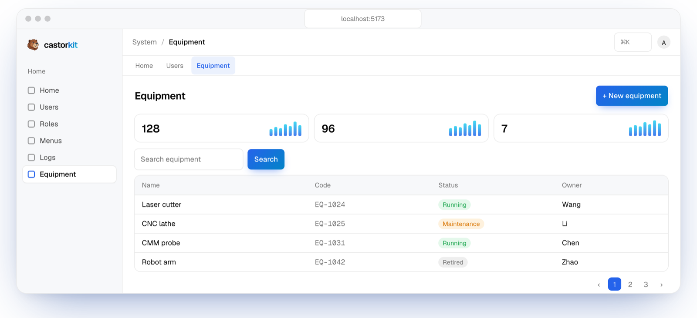

<p align="center">
  <picture>
    <source media="(prefers-color-scheme: dark)" srcset=".github/assets/wordmark-dark.svg">
    
  </picture>
</p>

<p align="center">
  <strong>AI ファーストのフルスタック管理スキャフォールド。</strong><br>
  機能を自然な言葉で書くだけで、検証済みの完全なモジュールが手に入ります。<br>
  テーブル、API、画面、権限、マイグレーションまで。
</p>

<p align="center">
  <a href="https://github.com/robeshell/castor-kit/actions/workflows/ci.yml"></a>
  <a href="LICENSE"></a>
  
  
  
  <a href="CONTRIBUTING.md"></a>
</p>

<p align="center">
  <a href="website/ja/guide/index.md">ドキュメント</a> ·
  <a href="#クイックスタート">クイックスタート</a> ·
  <a href="CONTRIBUTING.md">コントリビュート</a> ·
  <a href="README.md">English</a> ·
  <a href="README_CN.md">简体中文</a> ·
  <b>日本語</b>
</p>

<p align="center">
  <picture>
    <source media="(prefers-color-scheme: dark)" srcset=".github/assets/screenshot-dark.png">
    
  </picture>
</p>

---

## なぜ castor-kit か

多くのスキャフォールドは出発点を用意するだけで、その先は開発者の規律任せです。castor-kit はその規律を書き残しました。[`AGENTS.md`](AGENTS.md) にはアーキテクチャ、命名、フィールド型の推論、権限、多言語のルールが、あらゆる AI コーディングツールが従える形で記述されています。さらにスキャフォールドと検証ゲートが、それらのルールを強制できる仕組みに変えます。人が書いても AI が書いても、千個目の機能は一個目と同じくらいきれいなままです。

> *Castor* はビーバーのラテン語の属名です。ビーバーは自然界のエンジニア。丸太を一本ずつ積み上げて、ダム全体を築き上げます。

## 特長

- **AI 駆動のワークフロー**：Claude Code、Cursor、GitHub Copilot、Windsurf、Codex CLI、MCP クライアント向けに設定済み。一文の依頼から、テーブル、API、画面、RBAC エントリー、マイグレーションを生成します。
- **納品ゲート**：`pnpm verify` が 15 項目を検査します。型チェック、レイヤー規約、マイグレーションチェーン、ルート登録、RBAC のシードと同期、OpenAPI の同期、API とフロントエンドのテスト、本番ビルド。
- **完全な RBAC**：ユーザー、ロール、メニュー、ボタン単位の権限。新しい機能は自動的に権限体系に組み込まれます。
- **デザインされた管理画面**：shadcn/ui + Tailwind CSS v4、6 色のアクセント、ライトとダーク、3 種類のナビゲーション、ページの状態を保持するタブバー。
- **3 言語対応**：UI と API エラーを中国語・英語・日本語で表示。スキャナーとテストが翻訳漏れを防ぎます。
- **25 以上のサンプル画面**：テーブル、ダッシュボード、チャート、Three.js の地球儀、AI チャット、エディター、カンバン、WebSocket ツールなど。
- **インポート / エクスポート**：フロントエンドとバックエンドの両方で CSV と XLSX に対応。行単位で検証します。
- **ワンライナーでデプロイ**：`bash setup.sh` が Docker Compose で PostgreSQL、API、Web アプリを起動し、マイグレーションと初期データ投入まで行います。

## 仕組み

```text
あなた ▸ 「設備台帳」を作って：名称、コード、状態、購入日、担当者

AI     ▸ 仕様（型、テーブル、メニュー、ボタン権限）を推論し、業務プレビューを提示
       $ pnpm scaffold -- --name equipment --domain admin --fields "name:str,code:str50,status:str20,purchase_date:date,owner:str"
       $ pnpm db:migrate
       $ pnpm seed:rbac -- --incremental
       $ pnpm verify -- --module equipment
       ✓ typescript_compile ✓ migration_chain ✓ router_registration ✓ rbac_sync ✓ api_tests ✓ frontend_tests ✓ frontend_build
```

全体の流れは [AI 駆動開発](website/ja/guide/ai-workflow.md) を参照してください。

## クイックスタート

**Docker（推奨）**：必要なのは Docker だけです。

```bash
git clone https://github.com/robeshell/castor-kit.git
cd castor-kit
bash setup.sh
```

ウィザードで管理者パスワードとポート（既定は `5000`）を設定し、必要に応じて AI 機能も構成します。完了したら `http://localhost:5000` を開き、`admin` でサインインします。

**ローカル開発**：Node 22 以上、pnpm、PostgreSQL 14 以上が必要です。

```bash
pnpm install
cp apps/api/.env.example apps/api/.env.development   # DEV_DATABASE_URL を設定
createdb castor_kit
pnpm db:migrate
pnpm seed:rbac
pnpm dev                                              # API :5001 · Web :5173
```

## 技術スタック

| レイヤー | 技術 |
|---|---|
| バックエンド | Node.js 22 · TypeScript · Fastify 5 · Zod 4 |
| データベース | PostgreSQL · Drizzle ORM（レビュー可能な SQL マイグレーション） |
| フロントエンド | React 19 · Vite · React Router 7 · i18next |
| UI | shadcn/ui（Radix）· Tailwind CSS v4 · Motion · lucide-react |
| データとチャート | TanStack Table · react-hook-form · ECharts 6 · Three.js |
| ツール | pnpm workspaces · Vitest · ESLint · MCP サーバー · Docker Compose |

## ディレクトリ構成

```text
apps/
  api/        Fastify API：db/schema → modules/<domain>/<name>/{schema,repository,service,routes}.ts
  web/        React アプリ：modules/<module>/pages/**、共通コンポーネント、翻訳ファイル
  mcp/        scaffold / verify / seed / マイグレーションを提供する MCP サーバー
docs/         アーキテクチャ資料、スキャフォールドのテンプレート
website/      ドキュメントとランディングサイト（VitePress）
AGENTS.md     人と AI ツールが共有する唯一の規約
```

## ドキュメント

ドキュメントは [`website/`](website) にあります。[概要](website/ja/guide/index.md)、[クイックスタート](website/ja/guide/getting-started.md)、[バックエンド](website/ja/guide/backend.md)、[フロントエンド](website/ja/guide/frontend.md)、[RBAC](website/ja/guide/rbac.md)、[多言語対応](website/ja/guide/i18n.md)、[テーマとレイアウト](website/ja/guide/appearance.md)、[デプロイ](website/ja/deploy/index.md) を扱っています。ローカルで閲覧するには：

```bash
npm --prefix website install
npm --prefix website run dev
```

## コントリビュート

Issue と Pull Request を歓迎します。まず [CONTRIBUTING.md](CONTRIBUTING.md) と [行動規範](CODE_OF_CONDUCT.md) をお読みください。セキュリティ上の問題は公開 Issue ではなく、[SECURITY.md](SECURITY.md) の手順で報告してください。

## ライセンス

[MIT](LICENSE) © castor-kit contributors
