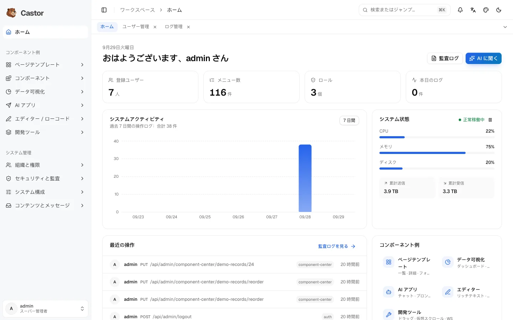

<div align="center">

<picture>
  <source media="(prefers-color-scheme: dark)" srcset=".github/assets/wordmark-dark.svg">
  
</picture>

### Node.js と React のための AI ファースト管理画面フレームワーク

今日から運用できる管理画面であり、AI エージェントが安全に拡張できるコードベースです。<br>
機能を説明すると、テーブル・API・画面・権限・テストがまとめて生成され、納品前に自動でチェックされます。

[](https://github.com/robeshell/castorjs/actions/workflows/ci.yml)
[](https://github.com/robeshell/castorjs/releases)
[](LICENSE)


[English](README.md) · [简体中文](README.zh-CN.md) · **日本語**

**[ドキュメント](https://castor.wenworks.dev/ja/)** · **[ライブデモ](https://castor.wenworks.app)** · [クイックスタート](#クイックスタート) · [AI ワークフロー](#ai-ワークフロー) · [変更履歴](CHANGELOG.md)

<br>

<picture>
  <source media="(prefers-color-scheme: dark)" srcset=".github/assets/screenshot-ja-dark.webp">
  
</picture>

</div>

## Castor を選ぶ理由

多くの管理画面テンプレートは最初の画面で終わります。Castor は社内システムに初日から必要なもの（認証、アクセス制御、監査、ファイル、連携）をそろえ、その後に続く何百もの機能を、開発者が書いても AI エージェントが書いても同じやり方で作れるようにします。

- **完全な基盤。** 2 段階認証付きのアカウント、ボタン単位のロール権限、部署ごとのデータ範囲、監査ログ、ファイルセンター、スケジュールジョブ、API トークンと Webhook。UI は 3 言語に対応。
- **AI エージェントのための設計。** 規約は [`AGENTS.md`](AGENTS.md) にまとまり、仕様駆動のスキャフォールドがモジュール全体を生成し、納品ゲート（型、マイグレーション、OpenAPI、権限、テスト、ビルド）が機能の完成を判定します。Claude Code、Cursor、Copilot、Codex など、リポジトリを読めるエージェントで使えます。
- **そのまま手本にできる実装。** 10 種類のページパターン（一覧、ツリー、カンバン、ガント、ステップフォームなど）と 11 のコンポーネントショーケースをソース付きで収録。生成コードは推測ではなく実績ある例に従います。
- **コードはすべてあなたのもの。** 最初から最後まで素の TypeScript、レビューできる SQL マイグレーション、独自ランタイムなし、MIT ライセンス。名前を変え、サンプルを隠し、その上にプロダクトを作れます。

## 機能

| 分野 | 内容 |
|---|---|
| **認証と権限** | サーバーサイドセッションのサインイン、2 段階認証（TOTP + リカバリーコード）、パスワードポリシーとリセット、サインインのロックアウトとレート制限。ロール、メニュー、ボタン単位の権限。部署ごとのデータ範囲 |
| **運用** | 操作ログとサインインログ、オンラインセッション、通知とお知らせ、データ辞書、cron で実行する HTTP ジョブ、参照追跡付きのファイルセンター（ローカルまたは S3 互換） |
| **連携** | スコープ付きの個人 API トークン、署名とリトライ付きの Webhook と配信ログ、コードと同期した OpenAPI 3 ドキュメント |
| **AI** | 質問に答え、ユーザーの承認を得て API 経由で操作するグローバルアシスタント。AI チャット、プロンプトスタジオ、自然言語 SQL などのサンプルを、ご自身のモデルプロバイダーで利用 |
| **インターフェース** | Tailwind CSS v4 ベースの shadcn/ui、ライト / ダークテーマ、6 つのアクセントカラー、3 つのナビゲーションレイアウト、キーボードとスクリーンリーダー対応、中国語 / 英語 / 日本語 |
| **データツール** | すべての一覧で Excel / CSV のインポートとエクスポート。行単位の検証とエラーレポート付き |
| **デプロイ** | 起動時にマイグレーションと権限同期を行う Docker Compose、設定不足なら起動しない本番構成、公開デモ用の Render + Neon ブループリント |

## クイックスタート

**Docker**（必要なのは Docker だけ）：

```bash
git clone https://github.com/robeshell/castorjs.git
cd castorjs
bash scripts/setup.sh
```

セットアップウィザードが管理者パスワードとポート（既定は `5000`）を尋ねます。`http://localhost:5000` を開き、`admin` でサインインしてください。

**ローカル開発**（Node.js 22+、pnpm、PostgreSQL 14+）：

```bash
pnpm install
cp apps/api/.env.example apps/api/.env.development   # DEV_DATABASE_URL を設定
createdb castor_kit
pnpm db:migrate && pnpm seed:rbac
pnpm dev                                              # API :5001 · web :5173
```

`http://localhost:5173` を開き、`admin` / `admin123` でサインインします。

**Render + Neon で公開デモをデプロイ**（無料プラン、データは毎日リセット）：[](https://render.com/deploy?repo=https://github.com/robeshell/castorjs) · [ガイド](https://castor.wenworks.dev/ja/deploy/)

Castor でプロダクトを作るなら、まず [新しいプロジェクトを始める](https://castor.wenworks.dev/ja/guide/new-project) を読んでください。命名、サンプルの非表示、本番公開、以降のリリースの取り込みを説明しています。

## AI ワークフロー

1. **エージェントに機能を説明する**：*「設備台帳を作って。名称、コード、分類、状態、購入日、担当者。インポートとエクスポートも。」*
2. **業務プレビューを確認する。** エージェントがモジュール仕様（フィールド、型、選択肢、メニュー、権限）を書き、何を作るかを業務の言葉で示します。
3. **エージェントが構築して検証する。** スキャフォールド、マイグレーション、権限同期を実行し、納品ゲートを通します：

```text
$ pnpm scaffold -- --spec equipment.spec.json
$ pnpm db:migrate && pnpm seed:rbac -- --incremental
$ pnpm verify -- --module equipment
  ✅ typescript compile   ✅ migration chain   ✅ openapi sync     ✅ router registration
  ✅ rbac seed            ✅ api tests         ✅ frontend tests   ✅ frontend build
  … 16 checks in total
✅ All checks passed. The feature is ready to deliver.
```

単純な一覧以外のページでは、エージェントがギャラリーから対応するページパターンをコピーします。詳しくは [AI ワークフロー](https://castor.wenworks.dev/ja/guide/ai-workflow) を参照してください。

## 技術スタック

| レイヤー | 技術 |
|---|---|
| バックエンド | Node.js 22、TypeScript、Fastify 5、Zod 4、Drizzle ORM、PostgreSQL |
| フロントエンド | React 19、TypeScript、Vite、React Router 7、shadcn/ui、Tailwind CSS v4、Motion、i18next |
| データとチャート | TanStack Table、react-hook-form、ECharts 6 |
| ツール | pnpm workspaces、Vitest、ESLint、エージェント向け MCP サーバー、Docker Compose |

```text
apps/api     Fastify API：db/schema → modules/<domain>/<name>/{schema,repository,service,routes}
apps/web     React アプリ：modules/<module>/pages、共通コンポーネント、ロケール
apps/mcp     スキャフォールド、検証、権限同期、OpenAPI のツールを提供する MCP サーバー
docs/        アーキテクチャ、スキャフォールドのテンプレート、ロードマップ
website/     ドキュメントサイト（VitePress）
AGENTS.md    人とエージェントが従う規約
```

## プロジェクトの状況

Castor は 1.0 以前で、開発が活発に進んでいます。リリースは [セマンティックバージョニング](https://semver.org/lang/ja/) に従い、マイグレーションは追記のみ。各リリースのアップグレード手順は [変更履歴](CHANGELOG.md) に記載しています。今後の予定は [ロードマップ](docs/roadmap.md) を参照してください。

## ドキュメント

- **ガイド：** [はじめに](https://castor.wenworks.dev/ja/guide/) · [クイックスタート](https://castor.wenworks.dev/ja/guide/getting-started) · [新しいプロジェクトを始める](https://castor.wenworks.dev/ja/guide/new-project) · [AI ワークフロー](https://castor.wenworks.dev/ja/guide/ai-workflow) · [バックエンド](https://castor.wenworks.dev/ja/guide/backend) · [フロントエンド](https://castor.wenworks.dev/ja/guide/frontend)
- **トピック：** [権限](https://castor.wenworks.dev/ja/guide/rbac) · [セキュリティ](https://castor.wenworks.dev/ja/guide/security) · [オープン API](https://castor.wenworks.dev/ja/guide/open-api) · [AI アシスタント](https://castor.wenworks.dev/ja/guide/assistant) · [国際化](https://castor.wenworks.dev/ja/guide/i18n)
- **リファレンス：** [コマンド](https://castor.wenworks.dev/ja/reference/commands) · [設定](https://castor.wenworks.dev/ja/reference/configuration) · [デプロイ](https://castor.wenworks.dev/ja/deploy/)

## コントリビュート

コントリビュートを歓迎します。まず [コントリビューションガイド](CONTRIBUTING.md) と [行動規範](CODE_OF_CONDUCT.md) をお読みください。脆弱性は [SECURITY.md](SECURITY.md) の手順に従って非公開で報告してください。

## ライセンス

[MIT](LICENSE) © Castor contributors

<div align="center">
<br>
<sub><i>Castor</i> はビーバーのラテン名。自然界のエンジニアです。</sub>
</div>
