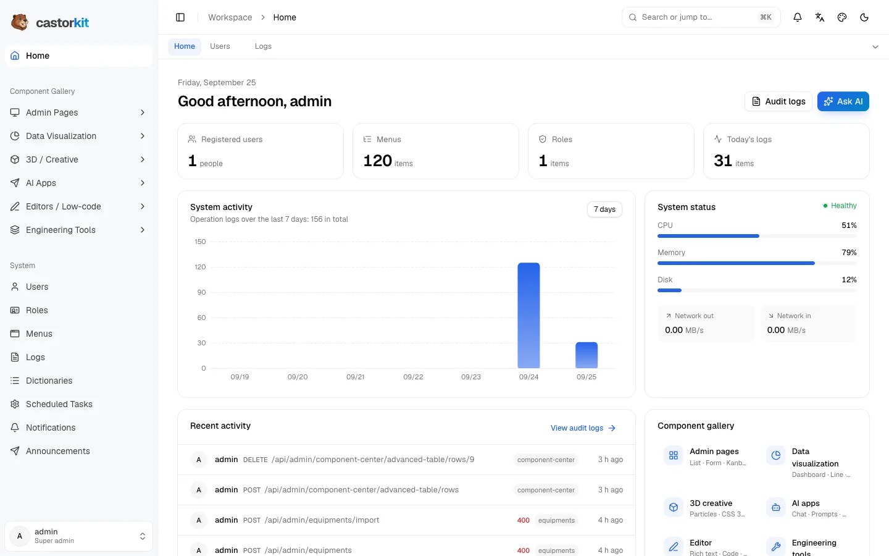

<div align="center">

<picture>
  <source media="(prefers-color-scheme: dark)" srcset=".github/assets/wordmark-dark.svg">
  
</picture>

### A ready-made admin panel. New features? Just ask AI.

Users, roles, permissions, menus and logs are already built.<br>
Describe a new page, and AI generates the table, API and UI — then checks that it all works.

[](https://github.com/robeshell/castor-kit/actions/workflows/ci.yml)
[](LICENSE)


[](CONTRIBUTING.md)

**English** · [简体中文](README_CN.md) · [日本語](README.ja.md)

[Documentation](https://robeshell.github.io/castor-kit/en/) · [Quick start](#quick-start) · [Build a feature with AI](#build-a-feature-with-ai) · [Contributing](CONTRIBUTING.md)

<br>

<picture>
  <source media="(prefers-color-scheme: dark)" srcset=".github/assets/screenshot-dark.webp">
  
</picture>

</div>

## What is castor-kit?

castor-kit is an open-source admin panel you can run today and extend with AI tomorrow.

- **Out of the box** — sign-in, users, roles, button-level permissions, menus, logs, dictionaries, scheduled tasks, notifications and announcements, in a polished UI with light and dark themes.
- **Built to be extended by AI** — the project's rules are written for AI coding tools (Claude Code, Cursor, Copilot, Codex CLI and more). Ask for a new page and you get the database table, API, UI and permissions, with automated checks before it's done.

## Features

<table>
  <tr>
    <td width="33%"><b>Permissions</b><br>Users, roles and menus, down to each button.</td>
    <td width="33%"><b>AI-ready</b><br>One sentence becomes a table, API, page and permissions.</td>
    <td width="33%"><b>Automated checks</b><br>15 checks: types, migrations, routes, RBAC, tests, build.</td>
  </tr>
  <tr>
    <td><b>Themes & layouts</b><br>Six accent colors, three layouts, light and dark, tabs bar.</td>
    <td><b>Three languages</b><br>Chinese, English and Japanese UI and error messages.</td>
    <td><b>Import & export</b><br>Excel and CSV for every table, with row-level validation.</td>
  </tr>
  <tr>
    <td><b>25+ example pages</b><br>Dashboards, charts, Kanban, 3D, AI chat, editors and more.</td>
    <td><b>Clean architecture</b><br>Clear layers, strict TypeScript, reviewable SQL migrations.</td>
    <td><b>One-command deploy</b><br>Docker Compose starts the database and the whole app.</td>
  </tr>
</table>

## Quick start

**With Docker** (recommended — only Docker is required):

```bash
git clone https://github.com/robeshell/castor-kit.git
cd castor-kit
bash setup.sh
```

The setup wizard asks for an admin password and a port (default `5000`). Then open `http://localhost:5000` and sign in as `admin`.

<details>
<summary><b>Local development</b> (Node.js 22+, pnpm, PostgreSQL 14+)</summary>

```bash
pnpm install
cp apps/api/.env.example apps/api/.env.development   # set DEV_DATABASE_URL
createdb castor_kit
pnpm db:migrate
pnpm seed:rbac
pnpm dev                                              # API :5001 · web :5173
```

</details>

## Build a feature with AI

1. **Describe it** to your AI tool: *"Build an Equipment registry: name, code, status, purchase date, owner."*
2. **Confirm the preview.** The AI works out field types, the table, the menu and permissions, and shows you a plain business summary.
3. **It builds and checks.** The AI runs the scaffold, migration and permission sync, then the delivery gate:

```text
$ pnpm scaffold -- --name equipment --domain admin --fields "name:str,code:str50,status:str20,purchase_date:date,owner:str"
$ pnpm db:migrate
$ pnpm seed:rbac -- --incremental
$ pnpm verify -- --module equipment
✓ typescript_compile  ✓ migration_chain  ✓ router_registration  ✓ rbac_sync
✓ api_tests  ✓ frontend_tests  ✓ frontend_build
```

The rules the AI follows live in [`AGENTS.md`](AGENTS.md). See [AI-driven workflow](website/en/guide/ai-workflow.md) for details.

## Tech stack

| Layer | Technology |
|---|---|
| **Backend** | Node.js 22 · TypeScript · Fastify 5 · Zod 4 · Drizzle ORM · PostgreSQL |
| **Frontend** | React 19 · Vite · React Router 7 · shadcn/ui · Tailwind CSS v4 · Motion · i18next |
| **Data & charts** | TanStack Table · react-hook-form · ECharts 6 · Three.js |
| **Tooling** | pnpm workspaces · Vitest · ESLint · MCP server · Docker Compose |

<details>
<summary><b>Project structure</b></summary>

```text
apps/
  api/        Fastify API: db/schema → modules/<domain>/<name>/{schema,repository,service,routes}.ts
  web/        React app: modules/<module>/pages/**, shared components, locales
  mcp/        MCP server exposing scaffold / verify / seed / migration tools
docs/         architecture notes and scaffold templates
website/      documentation and landing site (VitePress)
AGENTS.md     conventions shared by people and AI tools
```

</details>

## Documentation

| Section | Pages |
|---|---|
| Getting started | [Introduction](website/en/guide/index.md) · [Quick start](website/en/guide/getting-started.md) · [Project structure](website/en/guide/project-structure.md) |
| Development | [AI workflow](website/en/guide/ai-workflow.md) · [Backend](website/en/guide/backend.md) · [Frontend](website/en/guide/frontend.md) |
| Topics | [Permissions](website/en/guide/rbac.md) · [i18n](website/en/guide/i18n.md) · [Theme & layout](website/en/guide/appearance.md) |
| Reference | [Commands](website/en/reference/commands.md) · [Configuration](website/en/reference/configuration.md) · [Deployment](website/en/deploy/index.md) |

Read it online at **[robeshell.github.io/castor-kit](https://robeshell.github.io/castor-kit/en/)**, or browse it locally: `npm --prefix website install && npm --prefix website run dev`.

## Contributing

Issues and pull requests are welcome — please read the [contributing guide](CONTRIBUTING.md) and [code of conduct](CODE_OF_CONDUCT.md) first. Report security issues privately as described in [SECURITY.md](SECURITY.md). Notable changes are listed in the [changelog](CHANGELOG.md).

## License

[MIT](LICENSE) © castor-kit contributors

<div align="center">
<br>
<sub><i>Castor</i> is the Latin name for the beaver — nature's engineer, building a whole dam one log at a time.</sub>
</div>
