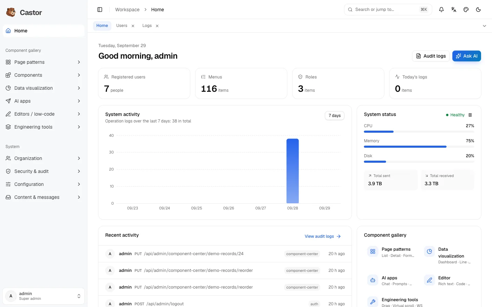

<div align="center">

<picture>
  <source media="(prefers-color-scheme: dark)" srcset=".github/assets/wordmark-dark.svg">
  
</picture>

### The AI-first admin framework for Node.js and React

A production-ready back office you can ship today, and a codebase AI agents extend safely:<br>
describe a feature, and it arrives with its table, API, UI, permissions and tests, checked before delivery.

[](https://github.com/robeshell/castorjs/actions/workflows/ci.yml)
[](https://github.com/robeshell/castorjs/releases)
[](LICENSE)


**English** · [简体中文](README.zh-CN.md) · [日本語](README.ja.md)

**[Documentation](https://castor.wenworks.dev)** · **[Live demo](https://castor.wenworks.app)** · [Quick start](#quick-start) · [How it works](#how-the-ai-workflow-works) · [Changelog](CHANGELOG.md)

<br>

<picture>
  <source media="(prefers-color-scheme: dark)" srcset=".github/assets/screenshot-dark.webp">
  
</picture>

</div>

## Why Castor

Most admin templates stop at the first screen. Castor covers what an internal system needs on day one (identity, access control, auditing, files, integrations) and makes the next hundred features predictable to build, whether a developer or an AI agent writes them.

- **Complete foundation.** Accounts with two-step verification, role-based access down to individual buttons, department data scopes, audit logs, a file center, scheduled jobs, API tokens and webhooks, in three languages.
- **Built for AI agents.** Conventions live in [`AGENTS.md`](AGENTS.md), a spec-driven scaffold generates whole modules, and a verification gate (types, migrations, OpenAPI, permissions, tests, build) decides when a feature is done. Works with Claude Code, Cursor, Copilot, Codex and any agent that reads the repository.
- **Reference implementations to copy.** Ten page patterns (lists, trees, kanban, gantt, wizards…) and eleven component showcases with their exact source, so generated code follows proven examples instead of guessing.
- **Yours to own.** Plain TypeScript end to end, SQL migrations you can review, no proprietary runtime, MIT licensed. Rename it, hide the examples and build your product on it.

## Capabilities

| Area | What you get |
|---|---|
| **Identity & access** | Sign-in with server-side sessions, two-step verification (TOTP + recovery codes), password policy and reset, sign-in lockout and rate limits; roles, menus and button-level permissions; data scopes by department |
| **Operations** | Audit and sign-in logs, online sessions, notifications and announcements, data dictionary, cron-scheduled HTTP jobs, a file center (local or S3-compatible) with reference tracking |
| **Integration** | Scoped personal API tokens, signed webhooks with retries and a delivery log, an OpenAPI 3 document kept in sync with the code |
| **AI** | A global assistant that answers questions and acts through the API with user approval; AI chat, prompt studio and natural-language SQL examples on your own model provider |
| **Interface** | shadcn/ui on Tailwind CSS v4, light and dark themes, six accent colors, three navigation layouts, keyboard and screen-reader support, Chinese / English / Japanese |
| **Data tooling** | Excel and CSV import and export on every list, with row-level validation and error reports |
| **Deployment** | Docker Compose with migrations and permission sync on start, fail-closed production config, a Render + Neon blueprint for public demos |

## Quick start

**Docker** (only Docker required):

```bash
git clone https://github.com/robeshell/castorjs.git
cd castorjs
bash scripts/setup.sh
```

The setup wizard asks for an admin password and a port (default `5000`). Open `http://localhost:5000` and sign in as `admin`.

**Local development** (Node.js 22+, pnpm, PostgreSQL 14+):

```bash
pnpm install
cp apps/api/.env.example apps/api/.env.development   # set DEV_DATABASE_URL
createdb castor_kit
pnpm db:migrate && pnpm seed:rbac
pnpm dev                                              # API :5001 · web :5173
```

Sign in at `http://localhost:5173` as `admin` / `admin123`.

**Public demo on Render + Neon** (free plans, data resets daily): [](https://render.com/deploy?repo=https://github.com/robeshell/castorjs) · [guide](https://castor.wenworks.dev/deploy/)

Building a product on Castor? Start with [Starting a project](https://castor.wenworks.dev/guide/new-project): naming, hiding the examples, going live and taking later releases.

## How the AI workflow works

1. **Describe the feature** to your agent: *"A device registry: name, code, category, status, purchase date and owner, with import and export."*
2. **Review the business preview.** The agent writes a module spec (fields, types, options, menu, permissions) and shows you what will be built in plain terms.
3. **The agent builds and verifies.** It scaffolds the module, applies the migration, syncs permissions and runs the delivery gate:

```text
$ pnpm scaffold -- --spec device.spec.json
$ pnpm db:migrate && pnpm seed:rbac -- --incremental
$ pnpm verify -- --module device
  ✅ typescript compile   ✅ migration chain   ✅ openapi sync     ✅ router registration
  ✅ rbac seed            ✅ api tests         ✅ frontend tests   ✅ frontend build
  … 16 checks in total
✅ All checks passed. The feature is ready to deliver.
```

For pages beyond a plain list, the agent copies the matching page pattern from the gallery. Details: [AI workflow](https://castor.wenworks.dev/guide/ai-workflow).

## Tech stack

| Layer | Technology |
|---|---|
| Backend | Node.js 22, TypeScript, Fastify 5, Zod 4, Drizzle ORM, PostgreSQL |
| Frontend | React 19, TypeScript, Vite, React Router 7, shadcn/ui, Tailwind CSS v4, Motion, i18next |
| Data & charts | TanStack Table, react-hook-form, ECharts 6 |
| Tooling | pnpm workspaces, Vitest, ESLint, an MCP server for agents, Docker Compose |

```text
apps/api     Fastify API: db/schema → modules/<domain>/<name>/{schema,repository,service,routes}
apps/web     React app: modules/<module>/pages, shared components, locales
apps/mcp     MCP server exposing scaffold, verify, RBAC sync and OpenAPI tools
docs/        architecture, scaffold templates, roadmap
website/     documentation site (VitePress)
AGENTS.md    the conventions people and agents follow
```

## Project status

Castor is pre-1.0 and moving quickly. Releases follow [semantic versioning](https://semver.org), migrations are append-only, and every release notes its upgrade steps in the [changelog](CHANGELOG.md). Planned work is tracked in the [roadmap](docs/roadmap.md).

## Documentation

- **Guide:** [Introduction](https://castor.wenworks.dev/guide/) · [Quick start](https://castor.wenworks.dev/guide/getting-started) · [Starting a project](https://castor.wenworks.dev/guide/new-project) · [AI workflow](https://castor.wenworks.dev/guide/ai-workflow) · [Backend](https://castor.wenworks.dev/guide/backend) · [Frontend](https://castor.wenworks.dev/guide/frontend)
- **Topics:** [Permissions](https://castor.wenworks.dev/guide/rbac) · [Security](https://castor.wenworks.dev/guide/security) · [Open API](https://castor.wenworks.dev/guide/open-api) · [AI assistant](https://castor.wenworks.dev/guide/assistant) · [i18n](https://castor.wenworks.dev/guide/i18n)
- **Reference:** [Commands](https://castor.wenworks.dev/reference/commands) · [Configuration](https://castor.wenworks.dev/reference/configuration) · [Deployment](https://castor.wenworks.dev/deploy/)

## Contributing

Contributions are welcome. Read the [contributing guide](CONTRIBUTING.md) and the [code of conduct](CODE_OF_CONDUCT.md) first, and report vulnerabilities privately as described in [SECURITY.md](SECURITY.md).

## License

[MIT](LICENSE) © Castor contributors

<div align="center">
<br>
<sub><i>Castor</i> is the Latin name of the beaver, nature's engineer.</sub>
</div>
