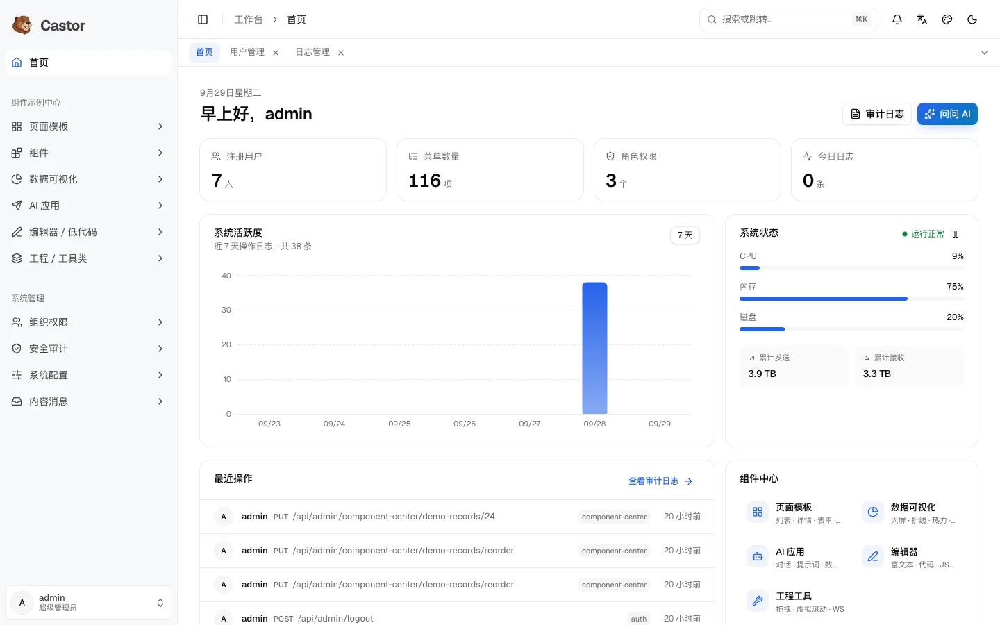

<div align="center">

<picture>
  <source media="(prefers-color-scheme: dark)" srcset=".github/assets/wordmark-dark.svg">
  
</picture>

### 面向 AI 的 Node.js + React 管理后台框架

今天就能上线的后台系统，也是 AI 能安全扩展的代码库：<br>
描述一个功能，数据表、接口、页面、权限和测试一并生成，交付前自动检查。

[](https://github.com/robeshell/castorjs/actions/workflows/ci.yml)
[](https://github.com/robeshell/castorjs/releases)
[](LICENSE)


[English](README.md) · **简体中文** · [日本語](README.ja.md)

**[文档](https://castor.wenworks.dev/zh/)** · **[在线演示](https://castor.wenworks.app)** · [快速开始](#快速开始) · [AI 工作流](#ai-工作流) · [更新日志](CHANGELOG.md)

<br>

<picture>
  <source media="(prefers-color-scheme: dark)" srcset=".github/assets/screenshot-zh-dark.webp">
  
</picture>

</div>

## 为什么选择 Castor

多数后台模板只做到第一屏。Castor 把内部系统第一天就需要的东西做齐了（身份、权限、审计、文件、集成），并让之后的上百个功能都能按同一套方式构建，不管是开发者写还是 AI 写。

- **完整的基础能力。** 支持两步验证的账号体系、细到按钮的角色权限、按部门的数据范围、审计日志、文件中心、定时任务、API 令牌和 Webhook，界面支持三种语言。
- **为 AI 智能体而设计。** 约定写在 [`AGENTS.md`](AGENTS.md) 里，基于规格的脚手架一次生成完整模块，交付闸门（类型、迁移、OpenAPI、权限、测试、构建）决定功能是否完成。适用于 Claude Code、Cursor、Copilot、Codex 以及任何会读仓库的智能体。
- **可直接照抄的参考实现。** 10 种页面模式（列表、树、看板、甘特图、分步表单……）和 11 个组件展示页，附带完整源码，生成的代码照着成熟示例写，而不是靠猜。
- **代码完全归你。** 从头到尾都是普通 TypeScript，SQL 迁移可审查，没有专有运行时，MIT 许可。改名、隐藏示例，然后在上面做你的产品。

## 功能一览

| 领域 | 内容 |
|---|---|
| **身份与权限** | 服务端会话登录、两步验证（TOTP + 恢复码）、密码策略与重置、登录锁定和限流；角色、菜单和按钮级权限；按部门的数据范围 |
| **运维** | 操作日志与登录日志、在线会话、通知与公告、数据字典、按 cron 调度的 HTTP 任务、文件中心（本地或 S3 兼容存储）及引用追踪 |
| **集成** | 可限定范围的个人 API 令牌、带签名和重试的 Webhook 及投递日志、与代码保持同步的 OpenAPI 3 文档 |
| **AI** | 全局助手：回答问题，经用户批准后通过 API 执行操作；AI 对话、提示词工作室、自然语言查询 SQL 等示例，使用你自己的模型服务 |
| **界面** | 基于 Tailwind CSS v4 的 shadcn/ui，亮色和暗色主题，六种强调色，三种导航布局，支持键盘和读屏器，中文 / 英文 / 日文 |
| **数据工具** | 每个列表都支持 Excel 和 CSV 导入导出，逐行校验并生成错误报告 |
| **部署** | Docker Compose，启动时自动执行迁移和权限同步；生产配置缺项即拒绝启动；提供公开演示用的 Render + Neon 蓝图 |

## 快速开始

**Docker**（只需要 Docker）：

```bash
git clone https://github.com/robeshell/castorjs.git
cd castorjs
bash scripts/setup.sh
```

安装向导会询问管理员密码和端口（默认 `5000`）。打开 `http://localhost:5000`，用 `admin` 登录。

**本地开发**（Node.js 22+、pnpm、PostgreSQL 14+）：

```bash
pnpm install
cp apps/api/.env.example apps/api/.env.development   # 设置 DEV_DATABASE_URL
createdb castor_kit
pnpm db:migrate && pnpm seed:rbac
pnpm dev                                              # API :5001 · web :5173
```

打开 `http://localhost:5173`，用 `admin` / `admin123` 登录。

**在 Render + Neon 上部署公开演示**（免费套餐，数据每天重置）：[](https://render.com/deploy?repo=https://github.com/robeshell/castorjs) · [指南](https://castor.wenworks.dev/zh/deploy/)

要基于 Castor 做产品？先看 [开始一个新项目](https://castor.wenworks.dev/zh/guide/new-project)：命名、隐藏示例、上线，以及合并后续版本。

## AI 工作流

1. **向智能体描述功能**：*“做一个设备台账：名称、编号、分类、状态、采购日期、负责人，支持导入导出。”*
2. **确认业务预览。** 智能体写出模块规格（字段、类型、选项、菜单、权限），用业务语言告诉你将要做什么。
3. **智能体构建并验证。** 它运行脚手架、执行迁移、同步权限，然后跑交付闸门：

```text
$ pnpm scaffold -- --spec equipment.spec.json
$ pnpm db:migrate && pnpm seed:rbac -- --incremental
$ pnpm verify -- --module equipment
  ✅ typescript compile   ✅ migration chain   ✅ openapi sync     ✅ router registration
  ✅ rbac seed            ✅ api tests         ✅ frontend tests   ✅ frontend build
  … 16 checks in total
✅ All checks passed. The feature is ready to deliver.
```

普通列表以外的页面，智能体会从示例中心复制对应的页面模式。详见 [AI 工作流](https://castor.wenworks.dev/zh/guide/ai-workflow)。

## 技术栈

| 层 | 技术 |
|---|---|
| 后端 | Node.js 22、TypeScript、Fastify 5、Zod 4、Drizzle ORM、PostgreSQL |
| 前端 | React 19、TypeScript、Vite、React Router 7、shadcn/ui、Tailwind CSS v4、Motion、i18next |
| 数据与图表 | TanStack Table、react-hook-form、ECharts 6 |
| 工具链 | pnpm workspaces、Vitest、ESLint、面向智能体的 MCP 服务、Docker Compose |

```text
apps/api     Fastify API：db/schema → modules/<domain>/<name>/{schema,repository,service,routes}
apps/web     React 应用：modules/<module>/pages、共享组件、语言包
apps/mcp     MCP 服务，提供脚手架、验证、权限同步和 OpenAPI 工具
docs/        架构说明、脚手架模板、路线图
website/     文档站（VitePress）
AGENTS.md    人和智能体共同遵循的约定
```

## 项目状态

Castor 处于 1.0 之前，迭代很快。版本遵循 [语义化版本](https://semver.org/lang/zh-CN/)，迁移只追加不修改，每个版本都在 [更新日志](CHANGELOG.md) 里写明升级步骤。后续计划见 [路线图](docs/roadmap.md)。

## 文档

- **指南：** [介绍](https://castor.wenworks.dev/zh/guide/) · [快速开始](https://castor.wenworks.dev/zh/guide/getting-started) · [开始一个新项目](https://castor.wenworks.dev/zh/guide/new-project) · [AI 工作流](https://castor.wenworks.dev/zh/guide/ai-workflow) · [后端](https://castor.wenworks.dev/zh/guide/backend) · [前端](https://castor.wenworks.dev/zh/guide/frontend)
- **专题：** [权限](https://castor.wenworks.dev/zh/guide/rbac) · [安全](https://castor.wenworks.dev/zh/guide/security) · [开放 API](https://castor.wenworks.dev/zh/guide/open-api) · [AI 助手](https://castor.wenworks.dev/zh/guide/assistant) · [国际化](https://castor.wenworks.dev/zh/guide/i18n)
- **参考：** [命令](https://castor.wenworks.dev/zh/reference/commands) · [配置](https://castor.wenworks.dev/zh/reference/configuration) · [部署](https://castor.wenworks.dev/zh/deploy/)

## 参与贡献

欢迎贡献。请先阅读 [贡献指南](CONTRIBUTING.md) 和 [行为准则](CODE_OF_CONDUCT.md)；安全漏洞请按 [SECURITY.md](SECURITY.md) 私下报告。

## 许可证

[MIT](LICENSE) © Castor contributors

<div align="center">
<br>
<sub><i>Castor</i> 是河狸的拉丁学名，大自然的工程师。</sub>
</div>
